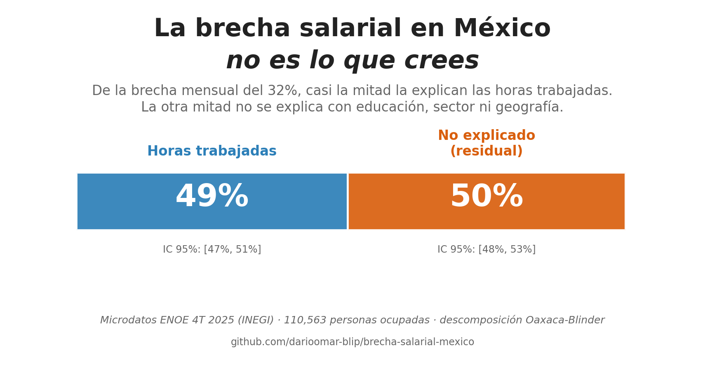
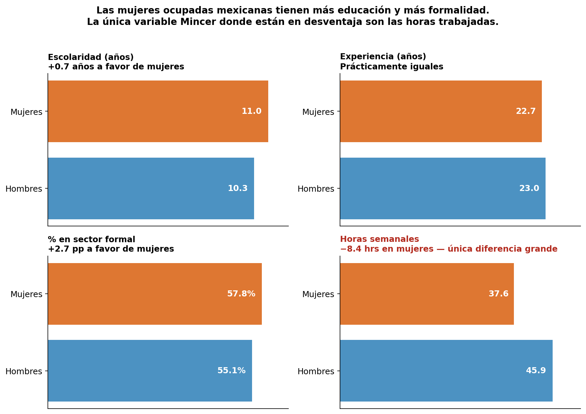
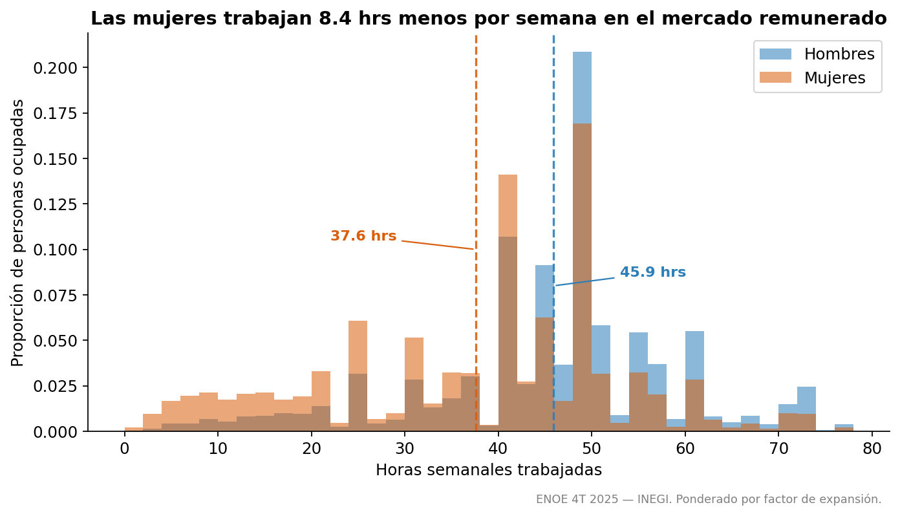
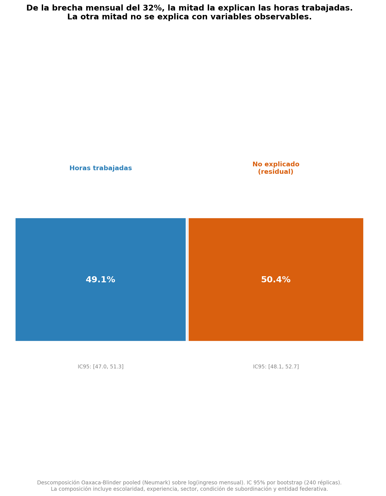
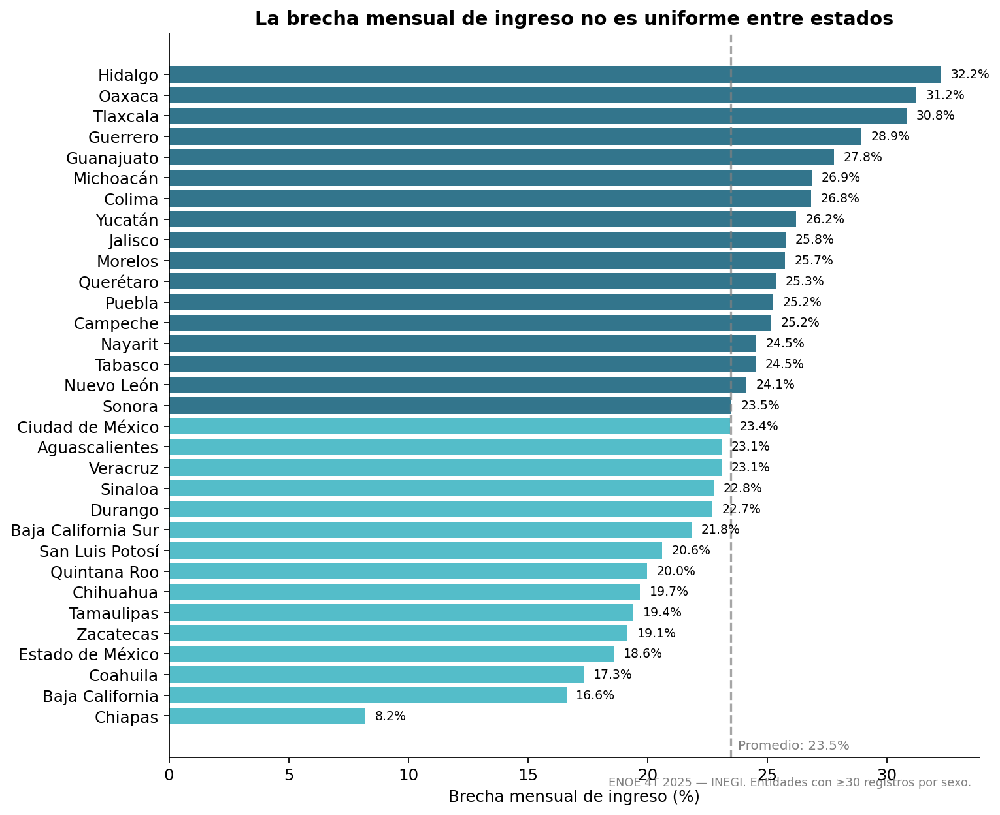

# La brecha salarial en México no es lo que crees

> De la brecha mensual del 32%, casi la mitad la explican las horas trabajadas. La otra mitad no se explica con educación, sector ni geografía.

**[→ Abrir dashboard interactivo](https://darioomar-blip.github.io/brecha-salarial-mexico/)** · gráficos en Plotly con hover, zoom y mapa coroplético de México.



---

## Resumen

Las mujeres mexicanas ocupadas se llevan a casa 23% menos que los hombres al mes. La explicación más común — "ganan menos porque están menos calificadas o en sectores peor pagados" — no se sostiene con los datos. Las mujeres ocupadas tienen, en promedio, **más años de escolaridad y mayor presencia en sector formal** que los hombres.

Apliqué descomposición Oaxaca-Blinder ponderada sobre microdatos de la ENOE 4T 2025 (INEGI). El resultado: la brecha mensual se descompone en 49% horas trabajadas + 50% no explicado. La composición observable (educación, sector, formalidad, entidad federativa) suma cero. Y el residual del 50% es robusto a corrección de Heckman por sesgo de selección.

## Pregunta de negocio

¿Cuánto de la brecha mensual de ingreso entre hombres y mujeres en México se justifica con variables observables y cuánto queda sin explicación?

- **Hipótesis inicial:** la mayoría de la brecha se explica vía horas + composición sectorial.
- **Resultado:** horas sí explican mucho (49%). Composición no aporta (0.5%, IC: −2%, +3%).
- **Métrica de éxito:** descomposición con IC bootstrap al 95% que replique las cifras agregadas oficiales.

## Datos

- **Fuente:** [ENOE — Encuesta Nacional de Ocupación y Empleo](https://www.inegi.org.mx/programas/enoe/15ymas/#microdatos), 4to trimestre 2025, INEGI.
- **Tamaño:** 419,038 registros crudos · 110,563 después del filtro a muestra de análisis · 33 millones de personas representadas vía factor de expansión.
- **Limitaciones honestas:**
  - "No explicado" no es estrictamente "discriminación". Puede capturar habilidades no observadas, preferencias laborales, redes profesionales, calidad de la educación. Es un techo, no una medida exacta.
  - Heckman corrige selección observable. Si hay variables omitidas que afectan tanto participación como salario y no están en ninguna ecuación, la corrección no las arregla.
  - Variables no incluidas que pueden importar: tamaño de empresa, antigüedad en el puesto, presencia de hijos solo se midió como conteo en el hogar.

## Stack técnico

- **Lenguaje:** Python 3.11
- **Librerías:** pandas, numpy, statsmodels (WLS + probit con errores HC3), scipy, matplotlib
- **Técnica principal:** descomposición Oaxaca-Blinder pooled (Neumark, 1988) con bootstrap no paramétrico de 240 réplicas
- **Corrección de robustez:** Heckman (1979) con restricción de exclusión vía estado civil y niños menores de 6 en el hogar

## Metodología

1. **Limpieza:** pegado de tabla SDEMT, construcción de variables Mincer (escolaridad, experiencia potencial, sector, condición de subordinación), winsorización al 1% y 99% del ingreso por factor de expansión.
2. **EDA ponderado:** distribuciones por sexo, brecha bruta por nivel educativo y entidad federativa.
3. **Mincer separado por sexo:** WLS sobre log(ingreso mensual) con errores robustos HC3, ponderado por factor de expansión.
4. **Oaxaca-Blinder pooled:** descomposición en tres bloques (horas, composición, residual). IC 95% por bootstrap (240 réplicas con reemplazo).
5. **Heckman:** probit de participación sobre toda la muestra de mujeres en edad laboral, ratio inverso de Mills como control en la etapa 2.

## Hallazgos clave

1. **La brecha bruta mensual es de 23%**, consistente con cifras oficiales del INEGI. En log es 0.32, equivalente a ~32% en términos directos.

2. **Las mujeres ocupadas tienen más educación (11.0 vs 10.3 años) y más subordinación formal (57.8% vs 55.1%)** que los hombres. La explicación "ganan menos porque están menos calificadas" se cae con datos.

3. **La descomposición Oaxaca-Blinder da casi exactamente mitad y mitad:** 49% de la brecha la explican las horas trabajadas, 50% queda residual, 0.5% lo aporta la composición observable (estadísticamente indistinguible de cero).

4. **El residual del 50% equivale a ~16% de salario adicional sin explicación**. A todo igual (mismas horas, misma educación, mismo sector, misma entidad), las mujeres se llevan ese 16% menos.

5. **Heckman no mueve el resultado.** El coeficiente del inverso de Mills no es significativo (p = 0.52). La brecha residual del 50% es robusta al sesgo de selección observable.

## Visualizaciones destacadas

### El problema en una imagen

*Las mujeres ocupadas tienen más educación, igual experiencia, más subordinación formal. La única variable Mincer donde están en desventaja son las horas trabajadas.*

### La distribución bimodal de horas

*Mientras los hombres se concentran en 40-50 horas, las mujeres se reparten entre jornada completa y un grupo amplio con jornadas parciales que casi no existe en hombres.*

### La descomposición Oaxaca-Blinder

*49% horas + 50% residual. La composición (escolaridad, sector, formalidad, entidad) no aporta. Bootstrap de 240 réplicas.*

### Brecha por entidad federativa

*Varía 4× entre estados — desde 8% en Chiapas (probablemente con sesgo de selección alta) hasta 32% en Hidalgo.*

## Reproducir el análisis

```bash
# Clonar
git clone https://github.com/darioomar-blip/brecha-salarial-mexico.git
cd brecha-salarial-mexico

# Crear ambiente
python -m venv .venv
source .venv/bin/activate
pip install -r requirements.txt

# Bajar datos del INEGI manualmente (5 minutos)
# https://www.inegi.org.mx/programas/enoe/15ymas/#microdatos
# Mover el contenido a data/raw/enoen_2025_4t/
# (la nomenclatura del INEGI varía; los notebooks detectan archivos por patrón)

# Correr notebooks en orden
jupyter notebook notebooks/01_descarga_y_limpieza.ipynb
# ... y siguientes
```

## Estructura del repositorio

```
brecha-salarial-mexico/
├── data/
│   ├── raw/                     # CSVs ENOE (no se incluyen, ~200 MB)
│   └── processed/               # Parquet listos para análisis
├── notebooks/
│   ├── 01_descarga_y_limpieza.ipynb
│   ├── 02_eda.ipynb
│   ├── 03_mincer.ipynb
│   ├── 04_oaxaca_blinder.ipynb
│   ├── 05_heckman_robustez.ipynb
│   └── 06_visualizaciones_finales.ipynb
├── src/
│   ├── enoe_loader.py           # Lectura ENOE + variables Mincer
│   └── oaxaca.py                # Descomposición Oaxaca-Blinder + bootstrap
├── outputs/                     # Gráficos y CSVs derivados
└── README.md
```

## Qué aprendí en el proyecto

Tres cosas que me llevo:

Primera, sobre la diferencia entre brecha mensual y brecha por hora. Cuando bajé los datos esperaba ver una brecha por hora del 12-15% — el número que circula en titulares. Salió 1.9%. Mi primer instinto fue pensar que había bug. Resultó que el dato del 12-15% es brecha mensual, y la diferencia se explica porque las mujeres trabajan 8 horas menos a la semana. Lección: cuando un resultado choca con lo esperado, verifica el encuadre antes de revisar el código.

Segunda, sobre las marcas silenciosas. Mi loader inicial trataba la columna `sex` como entero, pero el INEGI la publica como string (`'1'`, `'2'`, `' '`). La comparación `serie == 2` siempre daba False y todos los registros quedaban marcados como hombres. El bug no lanzó error — solo produjo un resultado equivocado. Tres horas perdidas. Documentado en `enoe_loader.py` con comentario para mi yo del futuro.

Tercera, sobre la supresión estadística. La brecha bruta por hora es 1.9%; la residual sube a 7.5% cuando controlo por escolaridad y subordinación. Como las mujeres ocupadas están más capacitadas y más formalizadas, "deberían" ganar más por hora. Que no lo hagan revela una brecha que la cruda esconde. Es contraintuitivo y me costó entender por qué pasaba.

## Próximos pasos

- Incorporar variables omitidas: tamaño de empresa, antigüedad en el puesto, ocupación específica (no solo sector).
- Comparar el residual entre 2010 y 2025 para ver si la brecha está cerrándose o no.
- Repetir el análisis sobre datos de ENUT (Encuesta Nacional sobre Uso del Tiempo) para incorporar trabajo doméstico no remunerado, que ENOE captura mal.

---

*Proyecto de portafolio basado en microdatos públicos del INEGI. Análisis cerrado en mayo de 2026.*
